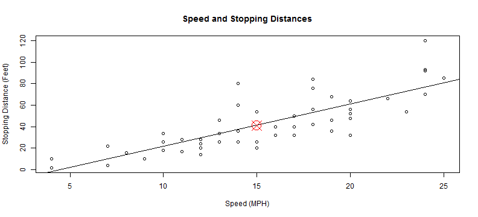

## Know When To Stop

When driving, it is important to know how much distance you need to safely stop a car. I've built a simple online tool you can use to estimate how much space you need based on the speed the car is moving.

---

## Example Prediction

The online tools uses a simple linear prediction model shown here. The user inputs a speed and the model estimates the required stopping distance.

Speed = 15 MPH

Prediction = 41

---

## Try It Yourself

1. [Online Tool](https://mattfrei.shinyapps.io/Data_Products_Project)

2. [R Code](https://github.com/mattfrei27/DataProducts)

---

## Disclaimer

Note that this analysis is based on data recoded in the 1920s. Also, many other factors, not available in this data set likely affect stopping distance (e.g. vehicle weight).
